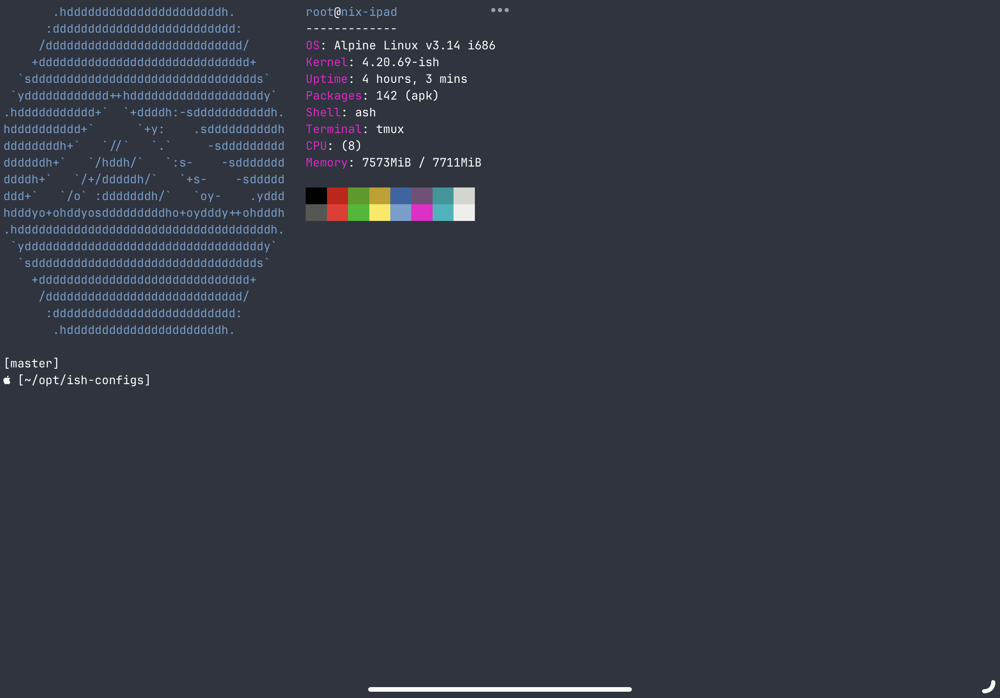

## iSH Configs

Tools/resources for configuring iSH on i[Pad]OS



### Requirements:

Get JetBrains Nerd Font here: https://github.com/ryanoasis/nerd-fonts/blob/master/patched-fonts/JetBrainsMono/Ligatures/Regular/JetBrainsMonoNerdFontMono-Regular.ttf

Install the font with [Fontcase](https://apps.apple.com/us/app/fontcase-manage-your-type/id1205074470)

Install BASH (just for the `./ish-setup.sh`, the script doesn't actually change the shell): `apk add bash`

## Install:

```
git clone https://github.com/heywoodlh/ish-configs ~/opt/ish-configs
cd ~/opt/ish-configs
./ish-setup.sh
```
